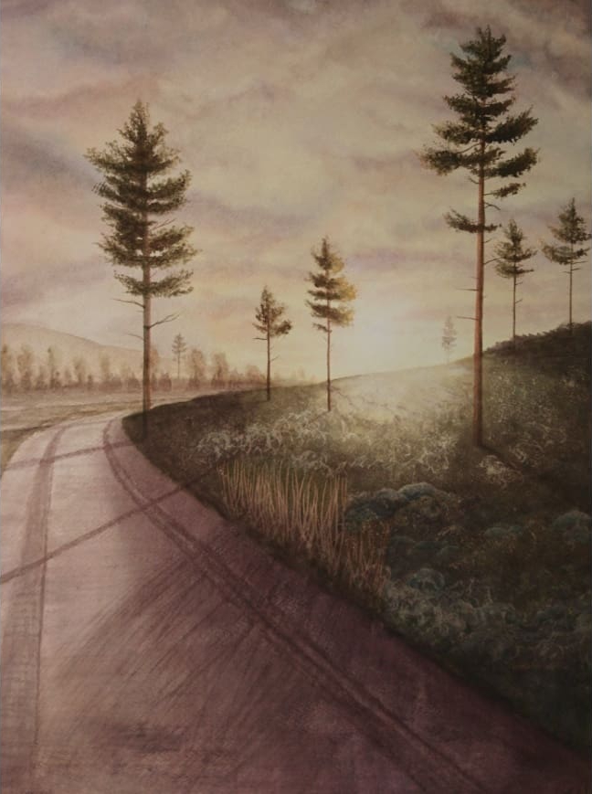

# Mitt första repo "Webbplats-1"

## Uppgift

I den här uppgiften skulle vi skapa ett nytt repo eller klona ett befintligt samt skriva en README.md fil till.

## Repository

Jag har valt att skapa ett repo av den första webbplatsen som jag prövade att göra innan själva utbildningen började. Jag följde då en video från [Webbutvecklingsprogrammets webbplats](https://webbutveckling.miun.se/)
som hjälpte mig att förstå lite grann av grunderna.

Jag lärde mig bland annat att:
* Skriva en del HTML-kod
* Skapa lite design med hjälp av CSS
* Lägga in bilder
* Skapa länkar

Jag valde att visa bilder av mina egna målningar på webbplatsen för att jag skulle vara säker på att jag inte tog någon som hade copyright.  

Akvarellmålning, "_Här finns lugnet_", 56 x 76 cm, 5 000kr. ●SÅLD

## Klona repository
För att klona mitt repository till din dator med hjälp av terminalen/kommandoprompten använder du kommandot:
* git clone https://github.com/elinanoren/Webbplats-1.git

Tack för att du tittade in på mitt första repo.

/Elina Norén